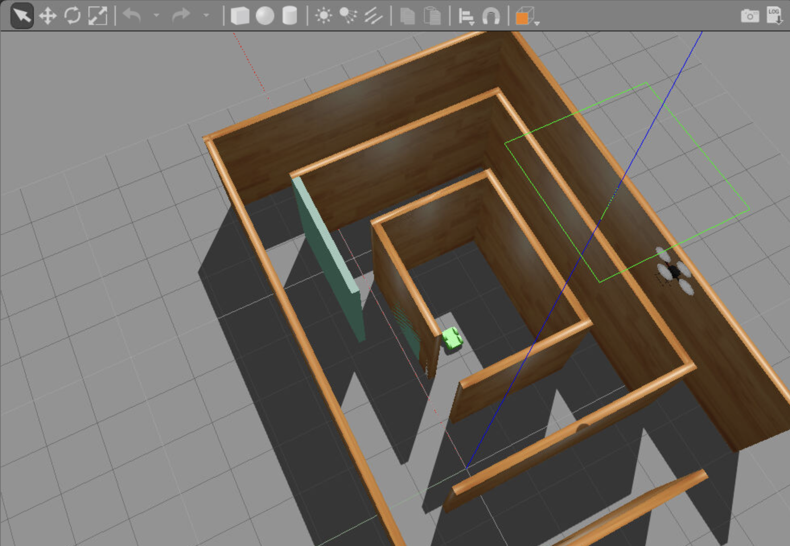
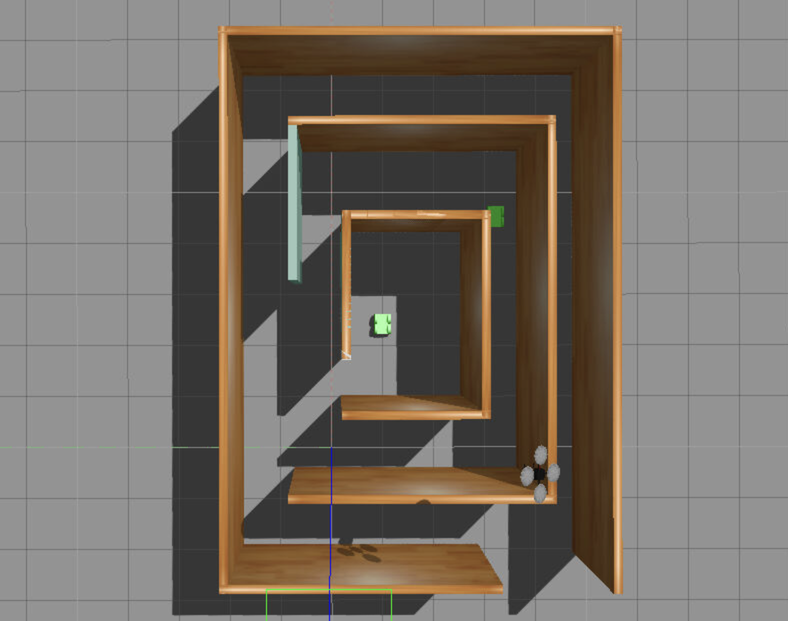

# Gazebo Project at Udacity
This is my first Gazebo project feating a 4 wheeled bot.



## 0. Pre-requisites
Make sure you have Gazebo and its tooling installed on your machine.

## 1. Building the Plugin
To run the project, make sure to set the project plugin to the directory, if you clone by default its ```<project_dir>``` is ```GazeboProject```

```
cd <project_dir>
mkdir build
cd build
cmake ..
make
```

## 2. Run the World !!!

To run the world, get to the project directory and make sure to have the plugin directory identified.

```
export GAZEBO_PLUGIN_PATH=${GAZEBO_PLUGIN_PATH}:<project_dir>/build
cd <project_dir>
gazebo world/aMazingWorld
```



